# AD-Project

## Objective
The objective of this project was to design and connect a multi–virtual machine lab environment to evaluate security monitoring and detection capabilities. This included establishing secure connectivity between Windows and Linux systems, performing attacks from a Kali Linux host, and analyzing the resulting telemetry in Splunk. The project also incorporated Atomic Red Team to simulate techniques mapped on the MITRE ATT&C and assess SIEM visibility, detection coverage, and potential monitoring gaps.

### Skills learned

- Built and managed a multi-VM lab environment with Windows, Linux, and Active Directory, including NAT networking and domain joining (Identify / Protect).
- Installed Splunk Enterprise on Ubuntu and deployed Universal Forwarder on Windows to centralize telemetry for analysis (Detect).
- Created custom Splunk searches to analyze user activity and account events, validating detection coverage (Detect / Respond).
- Executed Atomic Red Team simulations mapped to MITRE ATT&CK techniques (T1136.001, T1059.001) to test SIEM visibility (Detect / Respond).
- Identified a SIEM detection gap in PowerShell execution flags and proposed alerting improvements (Respond).
- Simulated controlled security events with Kali Linux to evaluate detection coverage and SIEM responsiveness (Detect / Respond).
- Planned and documented lab architecture and workflows, including VM setup, AD configuration, and SIEM integration (Govern / Identify).

### Tools Used

- **Virtualization**: Oracle VirtualBox
- **Operating Systems**: Windows 10, Windows Server 2019, Ubuntu Linux, Kali Linux
- **Security & Monitoring**: Splunk Enterprise, Splunk Universal Forwarder, Hydra on Kali Linux, Atomic-RedTeam

## Lab Architecture

The lab architecture was designed to emulate a small enterprise network for identity management, monitoring, and attack simulation purposes. 
 
   The lab environment consisted of four virtual machines connected via a NAT network in VirtualBox, each assigned a specific role to support Active Directory services, centralized log collection, and security testing. The network architecture, illustrated in the diagram created in Draw.io, shows dotted lines extending from the Windows Server and Windows 10 machines to the Splunk server, indicating their connections via the Splunk Universal Forwarder. The Windows Server VM hosted Active Directory and DNS services; the Windows 10 VM functioned as a domain-joined client and attack target; the Ubuntu VM ran a Splunk server for event log aggregation; and the Kali Linux VM was used to simulate threat activity.

 

*Figure 1: VirtualBox NAT-based network connecting AD, endpoint, SIEM, and Kali Linux.*

## System Configuration and Virtual Machine Setup

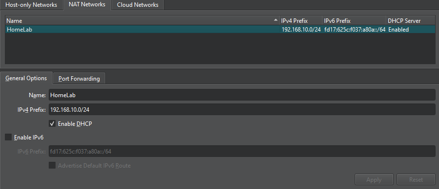

I've worked with virtual machines extensively in the National Guard; however, most of those systems are pre-built and pre-configured to communicate upon startup. In contrast, this project required selecting, installing, and configuring each virtual machine manually to ensure proper network connectivity, service functionality, and role separation. When choosing operating systems, I prioritized compatibility with Active Directory, Splunk, and common security tools, as well as overall system stability. VirtualBox was selected as the hypervisor due to its accessibility and support for NAT networking, which enabled virtual machines to communicate internally while remaining isolated from the host network. 

*Figure 2: Virtual machines running "Base" snapshot*

Due to hardware limitations on my laptop, the virtual machines were migrated to my desktop computer, which has greater processing power and memory. This ensured stable performance when running multiple virtual machines simultaneously, particularly during Active Directory operations, log forwarding, and security testing activities. The desktop environment enabled smoother service execution and reduced the performance bottlenecks observed during initial testing on the laptop. 

*Figure 3: NAT configuration in VirtualBox*

Each virtual machine was provisioned with appropriate CPU, memory, and storage resources based on its role. The Windows Server VM was configured with Active Directory Domain Services and DNS, the Windows 10 VM was joined to the domain, and the Kali Linux VM was prepared with standard penetration testing tools. The Ubuntu VM was configured to host the Splunk server, so I provisioned it with an extra CPU core and additional RAM, since it would be ingesting traffic from both the Windows server and the Windows client. Network settings were standardized across all machines to ensure consistent communication within the NAT network.

## Service Installation and Configuration

After the virtual machines were provisioned and network connectivity was verified, core services were installed and configured to support authentication, centralized logging, and security monitoring. This included deploying Active Directory Domain Services on the Windows Server, installing Splunk Enterprise on the Ubuntu system, and configuring Splunk Universal Forwarders on the Windows Server and Windows 10 machines to forward traffic logs to the SIEM. These configurations established the foundation for monitoring user activity and detecting malicious behavior.

### Active Directory Domain Services Setup

*Figure 4: Windows Server showing Active Directory Domain Services role installed.*

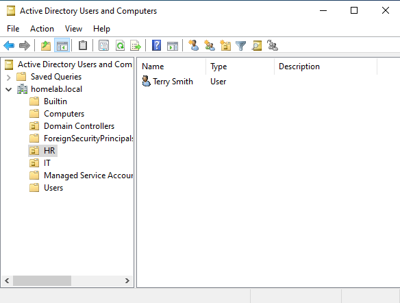

Setting up Active Directory Domain Services was straightforward, thanks to my extensive experience deploying AD during Army training, where I routinely configured domain controllers, user accounts, and group policies in lab environments. For this project, I installed the AD DS role on the Windows Server VM, promoted it to a domain controller, and created a new domain to manage the Windows 10 client. I also configured DNS services to ensure proper name resolution. To organize and manage resources within the domain, I created a new Organizational Unit (OU) named “CompanyOU”, and within this OU, I established two security groups: HR and IT, reflecting typical departmental structures. I then created a user account in each group to represent employees, assigning appropriate group membership and permissions. This setup allowed me to efficiently validate domain functionality, test group-based policies, verify access controls, and generate realistic event logs for Splunk ingestion and monitoring.

*Figure 5: homelab.local domain showing CompanyOU, HR, and IT groups, and user Terry Smith.*
 

 

### Splunk Enterprise Install
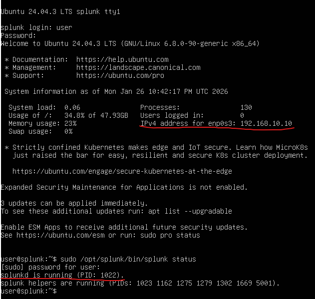
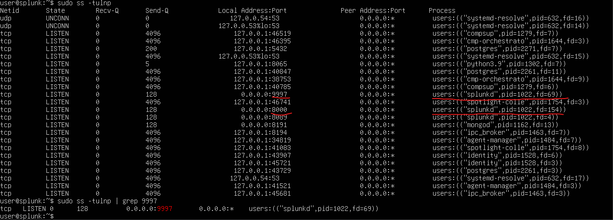

Installing Splunk Enterprise on the Ubuntu VM required a learning approach, as I had not previously set up the platform. I consulted the official Splunk documentation and additional online resources to guide the installation and configuration process. Using the command line, I downloaded and installed the Splunk package, started the service, and enabled web interface access. I also configured Splunk to start automatically on boot to ensure the service would remain active across system restarts. Once installed, I configured indexes and verified that the service was ready to receive logs from the Windows Server and Windows 10 machines. This process provided hands-on experience with Linux command-line operations, service management, and the setup of a centralized logging environment.

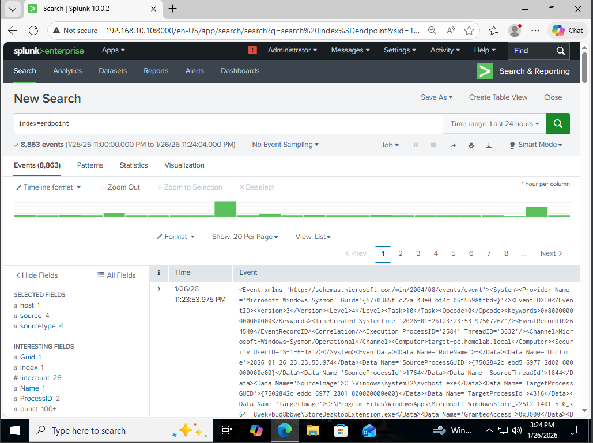

 

### Splunk Universal Forwarder Install
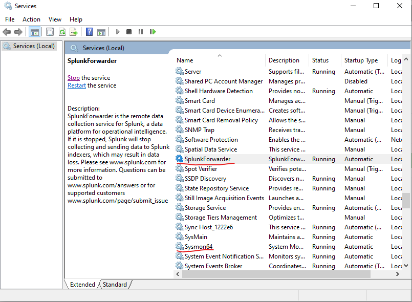
Installing the Splunk Universal Forwarder on the Windows Server and Windows 10 client was straightforward, as it followed the standard installation wizard similar to other Windows applications. After installation, I configured the forwarder to send selected event logs—such as Security, System, and Application logs—to the Splunk server on Ubuntu. I verified connectivity and ensured that logs were being received correctly, providing a reliable centralized logging pipeline. This setup allowed the Windows machines to continuously forward telemetry for monitoring and analysis, supporting the detection of user activity, group policy changes, and simulated attack events from the Kali Linux VM.
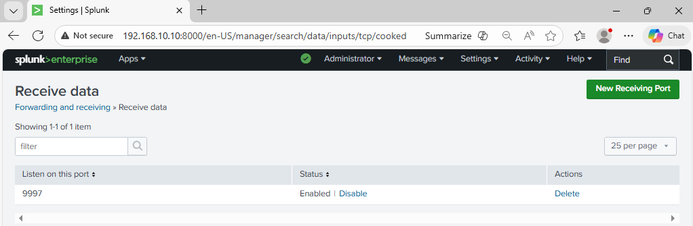

 

### Endpoint Configuration
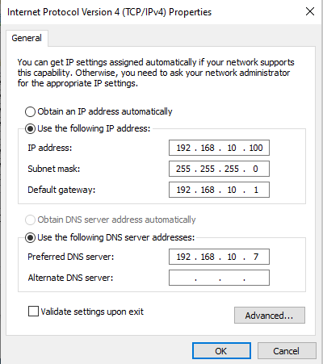
On the Windows 10 VM, I updated the network settings to use the Windows Server’s IP address (192.168.10.7) as the DNS server to ensure proper domain name resolution. I then joined the VM to the HomeLab domain and verified connectivity to the domain controller. To confirm that Active Directory was functioning correctly, I tested logging in with one of the previously created users, Terry Smith, which succeeded without issue. This step ensured that the client was fully integrated into the domain, allowing it to participate in group policies, send logs via the Splunk Universal Forwarder, and be included in subsequent security testing.
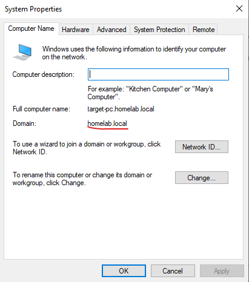

 

## Testing and Simulation

### Brute Force attack and logs
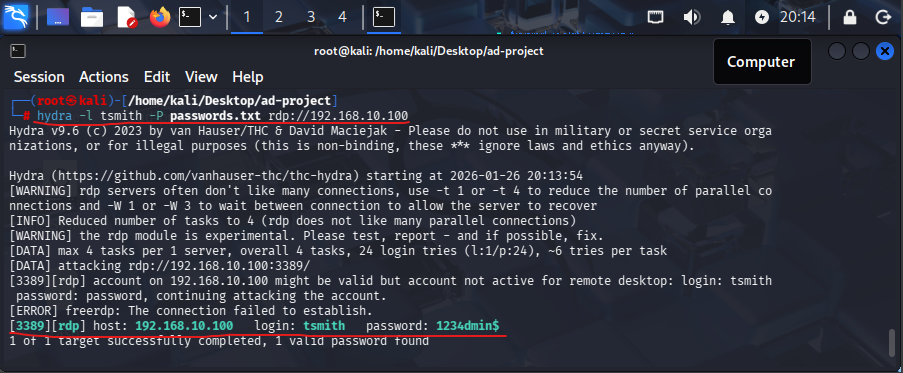
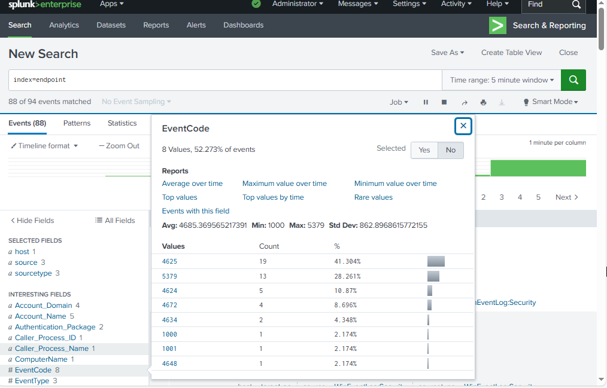
To validate the lab’s monitoring and detection capabilities, I performed controlled security simulations using the Kali Linux VM and Atomic Red Team techniques. This included executing safe, simulated attacks such as account creation, login attempts, and basic PowerShell commands mapped to MITRE ATT&CK techniques T1136.001 and T1059.001. The resulting events were forwarded to the Splunk server from both the Windows Server and Windows 10 client, allowing me to confirm that the SIEM accurately ingested logs, indexed events into the “endpoint” index, and displayed relevant information in search results. These tests demonstrated that the lab environment could detect changes in user activity, modifications to group membership, and simulated adversarial behavior, providing practical insight into SIEM visibility, detection coverage, and potential monitoring gaps.

 

### Atomic Red Team
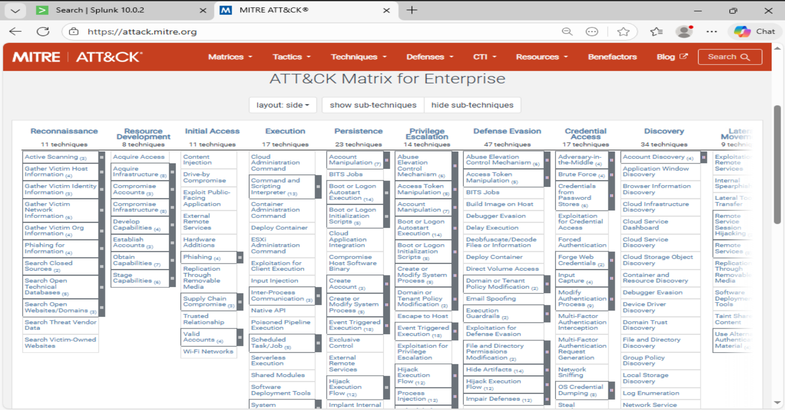 
 
Atomic Red Team was installed on the Windows 10 client using Windows PowerShell. Because I had not previously deployed Atomic Red Team, I consulted the official documentation and community guides to ensure proper installation. Once installed, the framework created an atomics directory containing hundreds of subfolders, each named after a specific MITRE ATT&CK technique identifier (for example, T1136.001 or T1059.001). These technique identifiers directly correspond to techniques listed in the MITRE ATT&CK framework, allowing individual test cases to be executed in a controlled manner. This structure made it easy to select and run specific adversary simulations and observe how those actions were logged and detected by Splunk.

 

#### Local Account Creation Attack
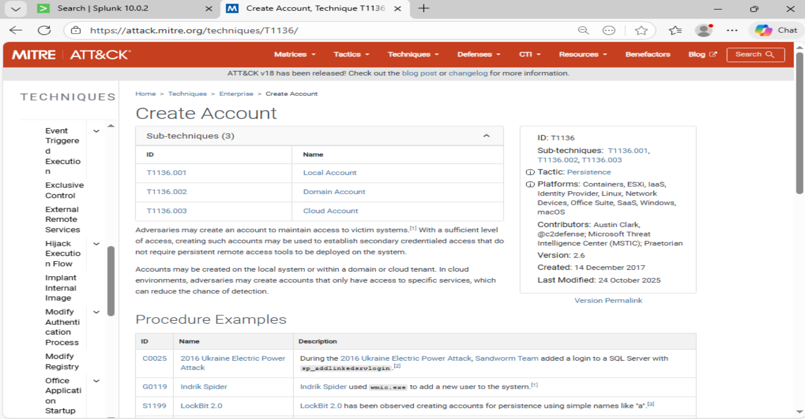

To demonstrate adversary behavior, I executed Atomic Red Team tests mapped to MITRE ATT&CK technique T1136.001 (Local Account Creation). This technique simulates an attacker creating a new local user account as a persistence mechanism. The MITRE ATT&CK framework documentation was referenced to understand the technique's purpose, expected behavior, and potential detection opportunities.

Figure X: MITRE ATT&CK technique T1136 – Create Account.

  

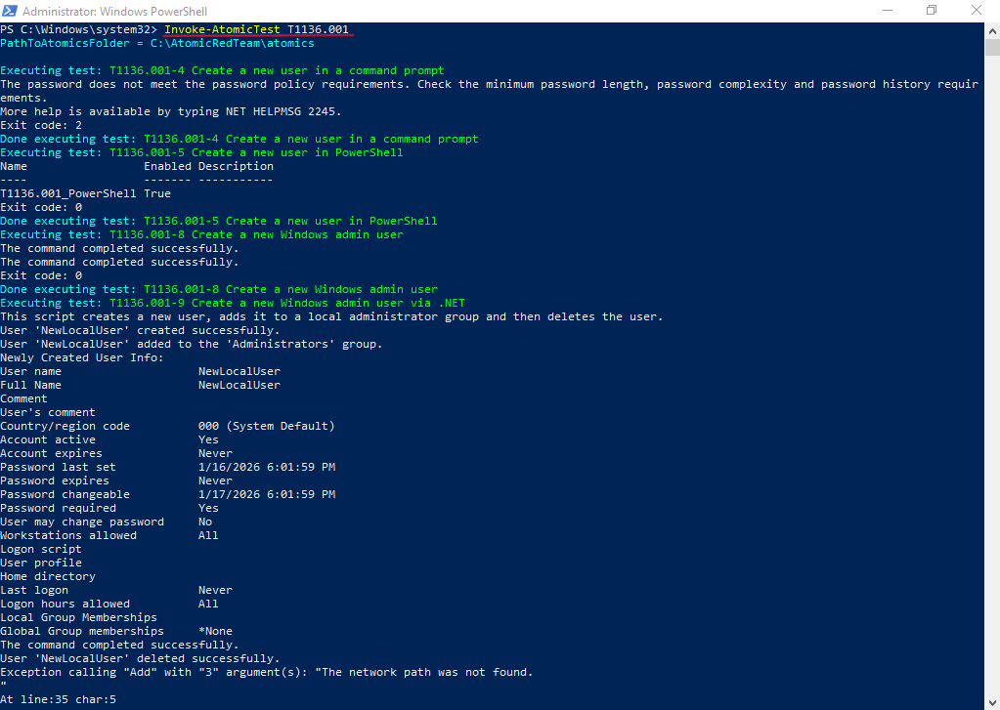

Using PowerShell on the Windows 10 client, I executed the Atomic Red Team test for T1136.001. The command triggered the creation of a local user account, generating multiple security-relevant events on the endpoint. This allowed me to observe how simulated attacker activity was recorded in Windows event logs and verify that the Splunk Universal Forwarder successfully forwarded those logs to the SIEM.

Figure X: Atomic Red Team T1136.001 execution using PowerShell on Windows 10.

  

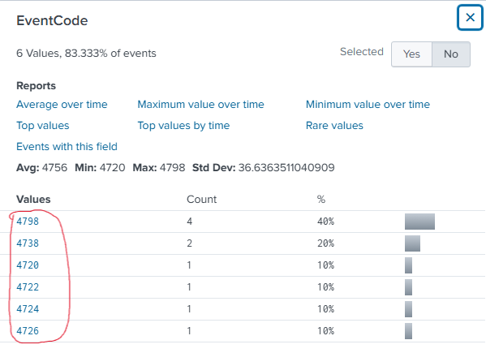

After execution, I searched the endpoint index in Splunk and identified several Windows Security Event IDs associated with account creation activity. These events confirmed that the Atomic Red Team simulation was producing detectable telemetry and that the logging pipeline was functioning correctly.

Figure X: Splunk showing Windows security event codes generated by Atomic Red Team execution.

  

To better understand the meaning of the generated event codes, I referenced UltimateWindowsSecurity.com, which provides detailed explanations of Windows security events. By correlating the event descriptions with the Atomic Red Team activity, I validated that the logs aligned with expected behavior for local account creation and assessed how easily this technique could be detected in the SIEM.

Figure X: Event code explanations from UltimateWindowsSecurity.com 

 

#### PowerShell Exploitation Attack

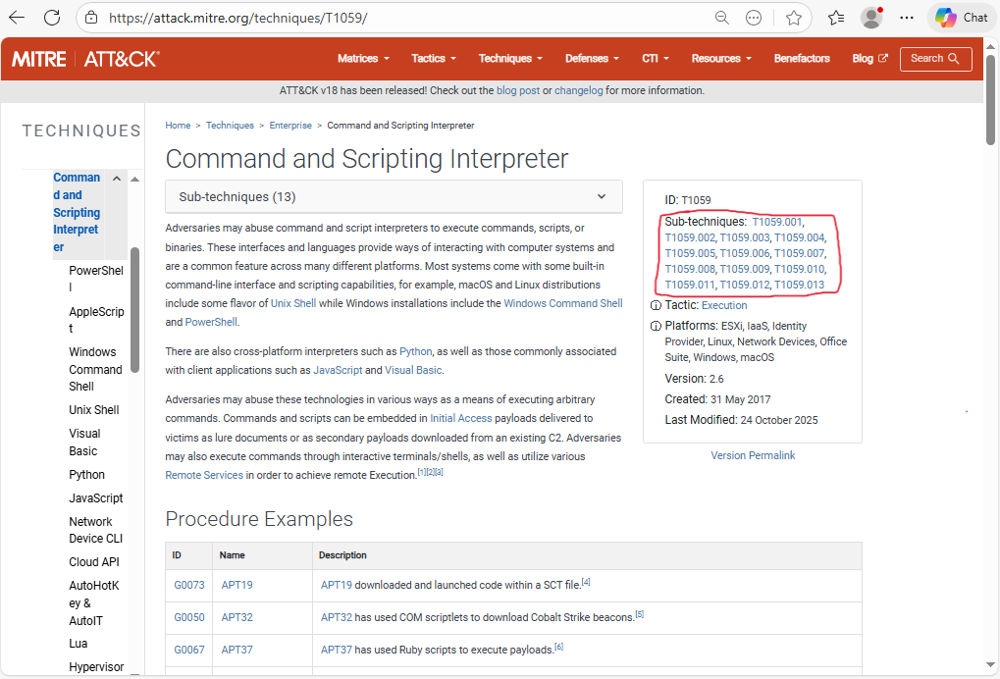

To further evaluate endpoint detection capabilities, I executed Atomic Red Team tests mapped to MITRE ATT&CK technique T1059.001 (PowerShell). This technique represents adversaries leveraging PowerShell to execute malicious commands, download payloads, and bypass security controls. The MITRE ATT&CK documentation was referenced to understand common attacker behaviors and expected detection opportunities related to malicious PowerShell usage.

  

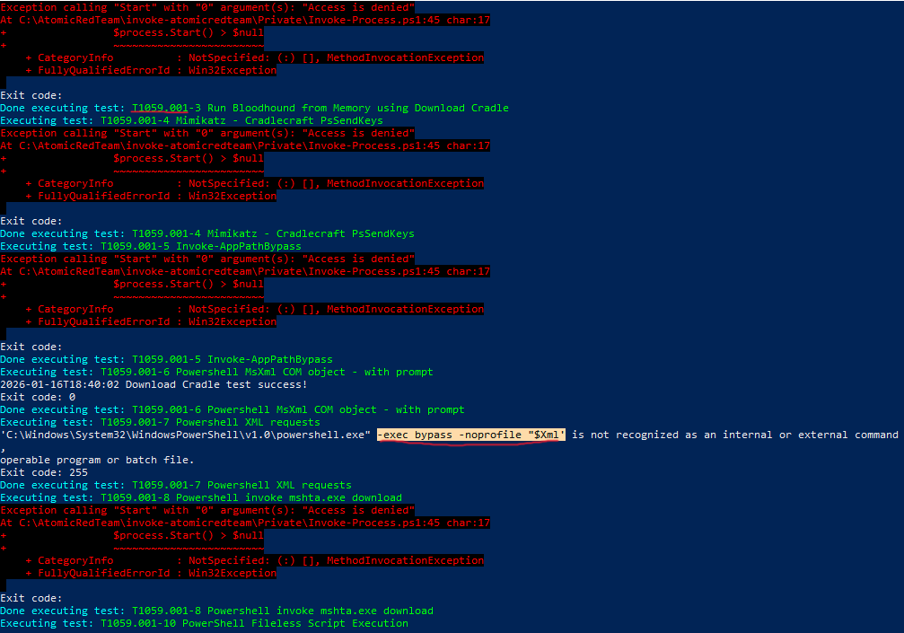

Using PowerShell on the Windows 10 client, I executed the Atomic Red Team test for T1059.001. The simulation generated suspicious PowerShell activity, including command-line arguments commonly associated with execution policy bypass techniques. This behavior is frequently observed in real-world attacks, as adversaries attempt to evade PowerShell security restrictions and logging.

